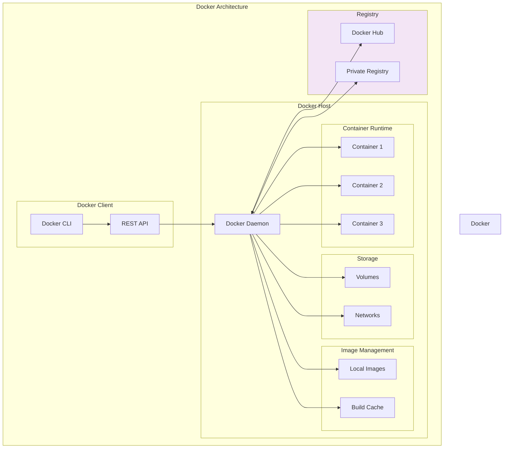
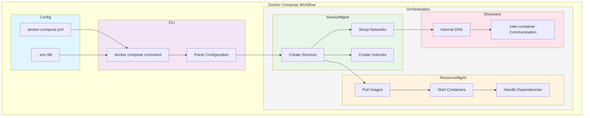

# Docker: From Theory to Practice

## 1. Understanding the Fundamentals

### Virtualization vs Containerization

#### Key Differences
- **Virtualization**: Creates complete virtual machines with their own operating systems
- **Containerization**: Shares the host OS kernel and isolates application processes

#### What's Included?

**In a Container:**
- Application code
- Dependencies
- Libraries
- Binaries
- Configuration files
- Minimal OS utilities
- No full operating system
- Typically megabytes in size

**In a Virtual Machine:**
- Full operating system
- Kernel
- System binaries
- Libraries
- Application code
- Dependencies
- Configuration
- Typically gigabytes in size

#### Benefits

**Virtual Machine Benefits:**
- Complete isolation from host system
- Can run different operating systems
- Full OS capabilities
- Better security isolation
- Ideal for running multiple applications with different OS requirements

**Container Benefits:**
- Lightweight and fast startup
- Efficient resource utilization
- Consistent environment across development and production
- Easy to share and distribute
- Perfect for microservices architecture
- Rapid scaling capabilities

### Microservices

#### What are Microservices?
Microservices are a software architecture style where applications are built as a collection of small, independent services that:
- Run in their own process
- Communicate via well-defined APIs
- Are independently deployable
- Have specific business functionality

#### How are they Made Possible?
Microservices are enabled by:
1. Container technology (like Docker)
2. Orchestration platforms (like Kubernetes)
3. API gateways
4. Service discovery tools
5. Load balancers
6. Monitoring solutions

#### Benefits
1. **Independent Deployment**: Services can be updated without affecting others
2. **Technology Flexibility**: Each service can use different technologies
3. **Scalability**: Services can be scaled independently
4. **Resilience**: Failure in one service doesn't bring down the entire application
5. **Team Autonomy**: Different teams can work on different services
6. **Easier Maintenance**: Smaller, focused codebases

### Docker

#### What is Docker?
Docker is a platform that packages applications and their dependencies into standardized units called containers. These containers can run consistently across different environments.



#### Alternatives
1. **Podman**: Daemonless container engine
2. **containerd**: Industry-standard container runtime
3. **LXC**: Linux Containers
4. **rkt**: Container engine by CoreOS
5. **OpenVZ**: Container-based virtualization for Linux

#### How Docker Works
Docker uses a client-server architecture:
1. **Docker Client**: Handles user commands
2. **Docker Daemon**: Manages Docker objects
3. **Docker Registry**: Stores Docker images
4. **Docker Objects**: Images, containers, networks, volumes

#### Success Story: Spotify
Spotify successfully migrated from a monolithic architecture to microservices using Docker:
- Reduced build times from 4+ hours to less than 15 minutes
- Enabled independent service deployments
- Improved development velocity
- Reduced infrastructure costs
- Better resource utilization
- Easier scaling during peak times

## 2. Practical Exercises

### Task 1: Running Your First Container

1. Open your terminal and verify Docker installation:
```bash
docker --version
```

2. Get help with Docker commands:
```bash
docker --help
```

3. List local Docker images:
```bash
docker images
```

4. Run your first container:
```bash
docker run hello-world
```

**What happens when you run it again?**
- First run: Docker pulls the image from Docker Hub if not found locally
- Subsequent runs: Docker uses the local image, no download needed

**Key Learning Points:**
- Docker checks local images first
- Automatically pulls from Docker Hub if needed
- Containers are ephemeral (temporary)

### Task 2: Running Nginx Web Server

1. Pull the latest nginx image:
```bash
docker pull nginx
```

2. Run nginx container:
```bash
docker run -d -p 80:80 nginx
```
- `-d`: Run in detached mode
- `-p 80:80`: Map port 80 on host to port 80 in container

3. Check running containers:
```bash
docker ps
```

4. Access nginx at: http://localhost or http://127.0.0.1

5. Stop the container:
```bash
docker stop <container_id>
```

**Key Learning Points:**
- Port mapping
- Detached mode
- Container management

### Task 3: Container Management

1. Start nginx container:
```bash
docker run -d -p 80:80 nginx
```

2. Try removing while running:
```bash
docker rm <container_id>
```
Error: Cannot remove running container

3. Force remove:
```bash
docker rm -f <container_id>
```

4. Verify removal:
```bash
docker ps -a
```

**Key Learning Points:**
- Container lifecycle
- Force removal
- Safety mechanisms

### Task 4: Modifying Running Containers

1. Run nginx:
```bash
docker run -d -p 80:80 nginx
```

2. Access container shell:
```bash
docker exec -it <container_id> bash
```

3. Update package list:
```bash
apt update && apt upgrade -y
```

4. Install required tools:
```bash
apt install sudo nano
```

5. Navigate to nginx content:
```bash
cd /usr/share/nginx/html
```

6. Edit index.html:
```bash
nano index.html
```

**Key Learning Points:**
- Container shell access
- Package management in containers
- File modification
- Container persistence

### Task 5: Multi-Container Setup

1. Run first nginx container:
```bash
docker run -d -p 80:80 nginx
```

2. Try running second container on same port:
```bash
docker run -d -p 80:80 daraymonsta/nginx-257:dreamteam
```
Error: Port already allocated

3. Run on different port:
```bash
docker run -d -p 90:80 daraymonsta/nginx-257:dreamteam
```

**Key Learning Points:**
- Port conflicts
- Port mapping flexibility
- Multiple container management

### Task 6: Image Management

1. Create custom image:
```bash
docker commit <container_id> my-custom-nginx
```

2. Push to Docker Hub:
```bash
docker tag my-custom-nginx username/my-custom-nginx
docker push username/my-custom-nginx
```

3. Run from Docker Hub:
```bash
docker run -d -p 80:80 username/my-custom-nginx
```

**Key Learning Points:**
- Image creation
- Image tagging
- Docker Hub interaction

### Task 7: Dockerfile Automation

1. Create project structure:
```bash
mkdir custom-nginx
cd custom-nginx
```

2. Create custom index.html:
```html
<!DOCTYPE html>
<html>
<head>
    <title>Custom Nginx</title>
</head>
<body>
    <h1>Welcome to Custom Nginx!</h1>
</body>
</html>
```

3. Create Dockerfile:
```dockerfile
FROM nginx
COPY index.html /usr/share/nginx/html/
EXPOSE 80
```

4. Build image:
```bash
docker build -t custom-nginx:v1 .
```

5. Run container:
```bash
docker run -d -p 80:80 custom-nginx:v1
```

**Key Learning Points:**
- Dockerfile syntax
- Image building
- Build context
- Layer caching

### Task 8: Docker Compose

#### What is Docker Compose?
Docker Compose is a tool for defining and running multi-container Docker applications. It uses a YAML file to configure your application's services, networks, and volumes, making it easy to manage complex applications with multiple interconnected containers.

#### How Docker Compose Works



The diagram above illustrates the key components and workflow of Docker Compose:

1. **Configuration Layer**
   - `docker-compose.yml`: Defines services, networks, and volumes
   - `.env file`: Contains environment variables for configuration

2. **Docker Compose CLI**
   - Processes commands like `up`, `down`, `build`
   - Parses configuration files and validates syntax

3. **Container Orchestration**
   - **Service Management**:
     - Creates services defined in compose file
     - Sets up networking between services
     - Manages persistent volumes
   
   - **Resource Management**:
     - Pulls required Docker images
     - Starts containers in correct order
     - Handles service dependencies
   
   - **Service Discovery**:
     - Provides internal DNS resolution
     - Enables container communication
     - Manages service names as hostnames

The workflow shows how Docker Compose takes your configuration files, processes the commands, sets up the required infrastructure, manages container lifecycle, and enables communication between services.

#### Why Use Docker Compose?
1. **Simplified Configuration**: Define your entire application stack in a single file
2. **Reproducible Environments**: Ensure consistent development, testing, and production environments
3. **Single Command Management**: Start, stop, and rebuild services with one command
4. **Automatic Container Networking**: Built-in service discovery between containers
5. **Environment Variable Management**: Easy configuration across different environments
6. **Volume Management**: Persistent data storage across container restarts

#### Installation Requirements
- Docker Engine (already installed if you have Docker Desktop)
- Docker Compose CLI (included with Docker Desktop for Windows/Mac)
- For Linux: Install separately using package manager

#### Docker Compose File Structure
```yaml
version: '3'  # Specify compose file version

services:     # Define your application services
  app:        # First service (your application)
    image: myapp:latest
    ports:
      - "3000:3000"
    
  database:   # Second service (database)
    image: mongo:latest
    volumes:
      - db-data:/data/db

volumes:      # Define named volumes
  db-data:    # Persistent storage for database
```

#### Essential Commands

1. **Start Application (Non-Detached Mode)**
```bash
docker compose up
```
- Runs in foreground
- Shows real-time logs
- Ctrl+C to stop

2. **Start Application (Detached Mode)**
```bash
docker compose up -d
```
- Runs in background
- Returns terminal control
- Must manually stop services

3. **Check Running Services**
```bash
docker compose ps
```

4. **View Real-Time Logs**
```bash
docker compose logs -f
```

5. **Stop Application**
```bash
docker compose down
```

6. **List Images**
```bash
docker compose images
```

**Key Differences: Detached vs Non-Detached Mode**
- **Non-Detached**: 
  - Immediate feedback
  - Good for development/debugging
  - Blocks terminal
- **Detached**: 
  - Runs in background
  - Better for production
  - Frees terminal for other tasks

#### Practical Example: Multi-Container Application

Let's examine a real-world example using a Node.js application with MongoDB:

```yaml
version: '3'

services:
  app:
    image: node-website:latest
    ports:
      - "3000:3000"
    networks:
      - app-network
    depends_on:
      - db
    environment:
      - DB_HOST=mongodb://db:27017/posts

  db:
    image: mongo:latest
    ports:
      - "27017:27017"
    networks:
      - app-network

networks:
  app-network:
    driver: bridge
```

**Key Components Explained:**
1. **Services**:
   - `app`: Node.js application
   - `db`: MongoDB database

2. **Networks**:
   - Creates isolated network
   - Enables service discovery
   - Containers can reference each other by service name

3. **Dependencies**:
   - `depends_on` ensures database starts first
   - Prevents application errors on startup

4. **Environment Variables**:
   - Configure application settings
   - Connect to database using service name

#### Database Seeding Methods

1. **Manual Seeding**:
```bash
docker compose exec app node seeds/seed.js
```

2. **Automated Seeding Methods**:

a. **Using Entrypoint Script**:
```bash
#!/bin/sh
# entrypoint.sh
npm install
node seeds/seed.js
npm start
```

b. **Using Docker Compose Command**:
```yaml
services:
  app:
    command: sh -c "node seeds/seed.js && npm start"
```

c. **Using Separate Seeder Service**:
```yaml
services:
  seeder:
    image: node-website:latest
    command: node seeds/seed.js
    depends_on:
      - db
```

#### Extension: Running on EC2

1. **Setup EC2 Instance**:
   - Install Docker
   - Install Docker Compose
   - Configure security groups (ports 3000, 27017)

2. **Deploy Application**:
   - Copy docker-compose.yml to instance
   - Run `docker compose up -d`
   - Access application via EC2 public IP

**Key Learning Points:**
- Multi-container orchestration
- Service networking
- Environment configuration
- Data persistence
- Container dependencies
- Automated database seeding
- Cloud deployment basics

## Common Terms and Concepts

- **Image**: Blueprint for containers
- **Container**: Running instance of an image
- **Dockerfile**: Instructions for building images
- **Registry**: Storage for Docker images
- **Layer**: Part of an image's filesystem
- **Volume**: Persistent storage for containers
- **Network**: Communication between containers
- **Tag**: Version identifier for images
- **Port**: Network endpoint for services
